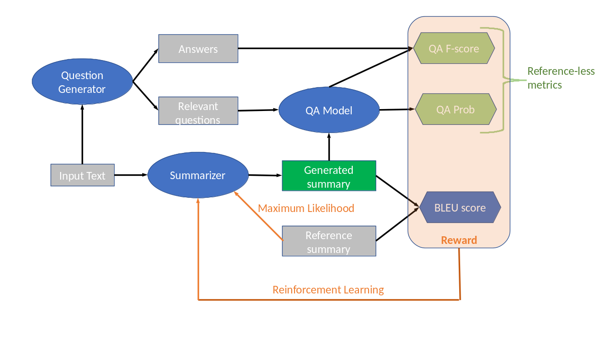

# SummaQA
*Supporting code for the EMNLP 2019 paper ["Answers Unite! Unsupervised Metrics for Reinforced Summarization Models"](https://arxiv.org/abs/1909.01610)*



## Quickstart
#### Clone & Install (*recommended: use a virtual environment*)
##### The following assumes PyTorch (>=1.1.0) is installed in your environment
```shell
git clone https://github.com/recitalAI/summa-qa.git
cd summa-qa
pip install -e .
```

#### Generate questions and answers for a text doccument

```python
from summaqa import QG_masked
question_generator = QG_masked()

article = """Super Bowl 50 was an American football game to determine the champion of the National Football League (NFL) for the 2015 season. The American Football Conference (AFC) champion Denver Broncos defeated the National Football Conference (NFC) champion Carolina Panthers 24–10 to earn their third Super Bowl title. The game was played on February 7, 2016, at Levi's Stadium in the San Francisco Bay Area at Santa Clara, California. As this was the 50th Super Bowl, the league emphasized the "golden anniversary" with various gold-themed initiatives, as well as temporarily suspending the tradition of naming each Super Bowl game with Roman numerals (under which the game would have been known as "Super Bowl L"), so that the logo could prominently feature the Arabic numerals 50."""

masked_questions, answer_spans = question_generator.get_questions(article)
```

#### Score a summary

```python
from summaqa import QA_Metric

qa_metric = QA_Metric()

summary_1 = """Super Bowl 50 determined the champion of the champion of NFL for the 2015 season."""
score_1 = qa_metric.compute(masked_questions, answer_spans, summary_1)
print("summary 1:", score_1)

summary_2 = "what what hello hi"
score_2 = qa_metric.compute(masked_questions, answer_spans, summary_2)
print("summary 2:", score_2)
```

*Output:*

```
summary 1: {'avg_prob': 0.0885990257628019, 'avg_fscore': 0.19888517279821627}
summary 2: {'avg_prob': 0.006263150813300972, 'avg_fscore': 0.0}

```

#### Score multiple summaries
```python
from summaqa import evaluate_corpus

srcs = [article, article]
gens = [summary_1, summary_2]

evaluate_corpus(srcs, gens)

```

*Output:*

```
{'avg_prob': 0.04743108828805144, 'avg_fscore': 0.09944258639910813}
```